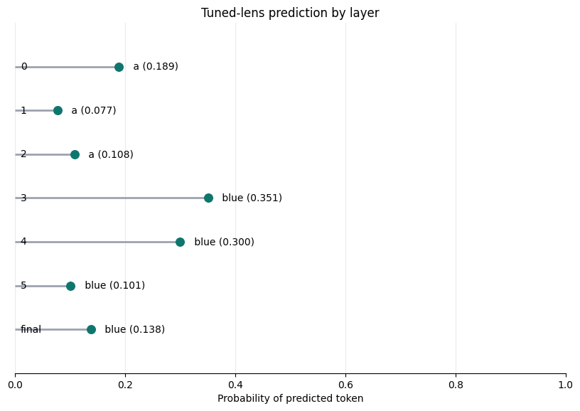
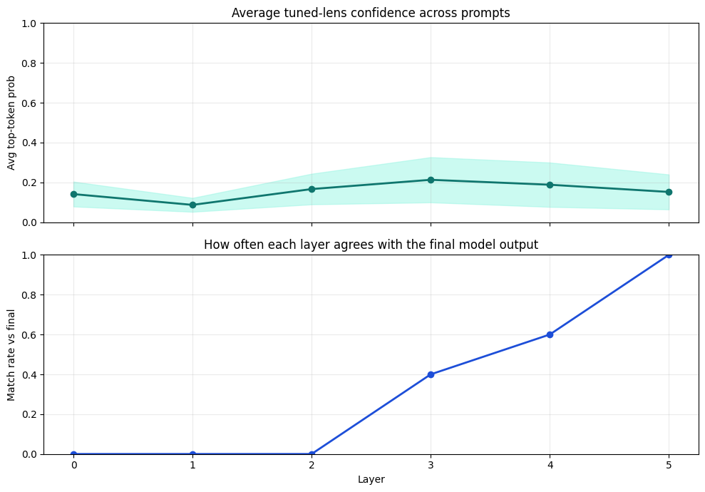
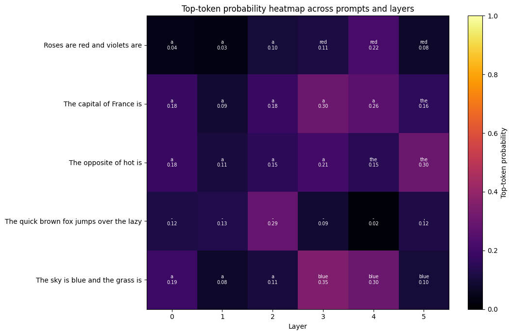

# Tuned Lens Project

This project looks at how a small language model changes its next-token prediction across layers.

- Model: `pythia-14M`
- Dataset: a small slice of `pile-10k`
- Main goal: compare `logit lens` and `tuned lens` predictions layer by layer
- Output: prompt-level results, a layer-by-layer visual, batch plots, and a heatmap

## Logit Lens vs. Tuned Lens

**Input prompt:** `The sky is blue and the grass is`

### Logit Lens

| layer | predicted token | probability |
|---|---|---:|
| 0 | `люч` | 0.177 |
| 1 | `itle` | 0.293 |
| 2 | `increased` | 0.053 |
| 3 | `"` | 0.162 |
| 4 | `red` | 0.115 |
| 5 | `blue` | 0.138 |
| final | `blue` | 0.138 |

### Tuned Lens

| layer | predicted token | probability | 2nd prediction | 3rd prediction |
|:---:|---|---|---|---|
| 0 | `a` | 0.189 | `the` (0.080) | `an` (0.057) |
| 1 | `a` | 0.077 | `the` (0.032) | `an` (0.022) |
| 2 | `a` | 0.108 | `also` (0.034) | `the` (0.027) |
| 3 | `blue` | 0.351 | `green` (0.111) | `red` (0.108) |
| 4 | `blue` | 0.300 | `red` (0.164) | `green` (0.089) |
| 5 | `blue` | 0.101 | `red` (0.093) | `green` (0.075) |
| final | `blue` | 0.138 | `red` (0.094) | `green` (0.089) |

For this prompt, the tuned lens starts off rough in the early layers, but by the middle layers it lines up with the final model output sooner than the logit lens does. The tuned lens strategy appears to be a bit more "systematic" than that of the logit lens, whose initial predictions appear to be completely random (e.g., a quotation mark and люч = sea bass?).

## Layer-by-Layer Tuned Lens Visual

This is the main single-prompt visual of the tuned lens. It shows the input at the top, then each layer's predicted token and the probability attached to that token.

## Batch Testing

This graph summarizes a few prompts at once. It shows:

- the average top-token probability at each layer
- how often each layer's prediction matches the final model output

## Heatmap

The heatmap shows top-token probabilities across prompts and layers. Each cell includes the predicted token and its probability, so it is easier to see both confidence and how predictions change over depth.

## Takeaways

- Early layers usually make rough or noisy guesses.
- Middle and later layers tend to look more stable.
- The tuned lens is useful because it learns a layer-specific affine map, instead of just using the raw unembedding like the logit lens.
- A tuned lens is better thought of as a way to inspect intermediate next-token predictions, not a literal view into an LLM's "thoughts" or individual neuron meanings.

Credits to Codex and ChatGPT for helping write the code!
